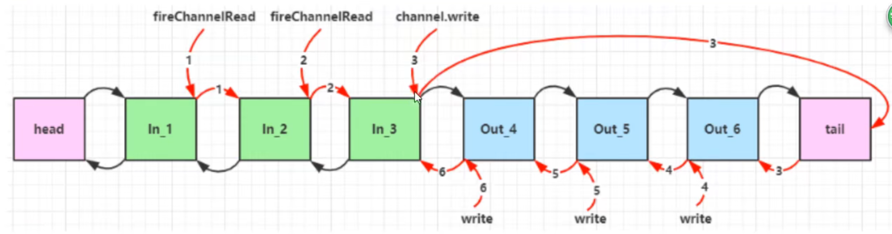

# NIO基础

non-blocking io 非阻塞io

## 1、三大组件

### 1.1 Channel & Buffer

channel类似于Stream，它就是读写的**双向通道**，可以从channel将数据读入buffer，也可以将buffer的数据写入channel，而Stream要么是输入要么是输出，channel比stream更为底层


常见的Channel有：

* FileChannel（文件）
* DatagramChannel（UDP）
* SocketChannel（TCP，客户端服务器都能用）
* SeverSocketChannel（TCP，专用于服务器）


buffer则用来缓冲读写数据，常见的buffer有：

* ByteBuffer
  * MappedByteBuffer
  * DirectByteBuffer
  * HeapByteBuffer
* ShortBuffer
* IntBuffer
* LongBuffer
* FloatBuffer
* DoubleBuffer
* CharBuffer


### 1.2 Selecter

服务器的设计演化过程如下：

#### 1.2.1 多线程版设计


**:warning:多线程版缺点**

* 内存占用高
* 线程上下文切换成本高
* 只适合连接数少的场景


#### 1.2.2 线程池版设计


:warning:**线程池版设计缺点**

* 阻塞模式下，线程仅能处理一个socket连接
* 仅适合短连接场景


#### 1.2.3 Selector版设计

selector的作用就是配合一个线程来管理多个channel，获取这些channel上发生的事件，这些channel工作在非阻塞模式下，不会让线程吊死在一个channel上，适合连接数特别多，低流量的场景（low traffic）


调用selector的select()会阻塞直到channel发生了读写就绪事件，这些事件发生后，select方法就会返回这些事件交给threa来处理


## 2、ByteBuffer

示例代码：

```java
@Slf4j
public class TestByteBuffer {

    public static void main(String[] args) {
        // FileChannel
        // 获取文件的两种方式1.输入输出流 2.RandomAccessFile
        try (FileChannel channel = new FileInputStream("testBuffer.txt").getChannel()) {
            // 准备缓冲区
            ByteBuffer buffer = ByteBuffer.allocate(10);
            // 从channel读取数据，向buffer写入
            while (channel.read(buffer) != -1) {
                // 切换至读模式
                buffer.flip();
                // 打印buffer数据
                while (buffer.hasRemaining()) {
                    byte b = buffer.get();
                    log.info("{}", (char) b);
                }
                // buffer切换为写模式，否则外面的while会死循环
                buffer.clear();
            }
        } catch (IOException e) {
            log.error("", e);
        }
    }
}
```


### 2.1 ByteBuffer的正确使用方式

1. 向buffer写入数据，例如调用channel.read(buffer)
2. 调用flip()切换至**读模式**
3. 从buffer读取数据，例如调用buffer.get()
4. 调用clear()或compact()切换至**写模式**
5. 重复步骤1~4


### 2.2 ByteBuffer结构

ByteBuffer有以下几个重要属性

* capacity
* position
* limit


一开始


写模式下，position是写入的位置，limit等于容量，下图表示了写入4个字节后的状态


filp()后，position切换为读取位置，limit切换为读取限制


读取4个字节后状态如下


clear()后position=0，limit=position状态如下


compact()是吧未读取完的部分向前压缩，然后切换至写模式


### 2.3 ByteBuffer常见方法

#### 2.3.1 分配空间

可以使用allocate方法为ByteBuffer分配空间，其他buffer类也有该方法

```java
// java堆内存，读写效率较低，受到GC影响 java.nio.HeapByteBuffer
ByteBuffer buf = ByteBuffer.allocate(16);
// 直接内存，读写效率较高（少一次拷贝），不会收GC影响，分配的效率低 java.nio.DirectByteBuffer
ByteBuffer buf = ByteBuffer.allocateDirect(16);
```


#### 2.3.2 向buffer写入数据

有两种方法

* 调用channel的read方法
* 调用buffer自己的put方法

```java
int readBytes = channle.read(buf);
```

和

```java
buf.put((byte) 127);
```


#### 2.3.3 从buffer读取数据

同样有两种方法

* 调用channel的write方法
* 调用buffer自己的get方法

```java
int writeBytes = channle.write(buf);
```

和

```java
byte b = buf.get();
```

get方法会使position读指针向后移动，如果想重复读取数据

* 可以调用rewind方法将position重置为0
* 或者调用get(int i)方法获取索引i的内容，它不会移动读指针


#### 2.3.4 mark和reset

mark是在读取的时候做一个标记，即使position改变，只要调用reset就能回到mark的位置


#### 2.3.5 字符串与ByteBuffer互转

```java
// 1.字符串转为ByteBuffer（需要手动调flip()方法才能读取）
ByteBuffer buffer1 = ByteBuffer.allocate(16);
buffer1.put("hello".getBytes());

//2.Charset（会自动将buffer切换为读模式）
ByteBuffer buffer2 = StandardCharsets.UTF_8.encode("hello");

//3.wrap（会自动将buffer切换为读模式）
ByteBuffer buffer3 = ByteBuffer.wrap("hello".getBytes());

buffer1.flip();
String str1 = StandardCharsets.UTF_8.decode(buffer1).toString();
String str2 = StandardCharsets.UTF_8.decode(buffer2).toString();
```


### 2.4 Scattering Reads

分散读取，有一个文本文件data.txt

```
1234567890abc
```

注意`channel.read(new ByteBuffer[]{b1, b2, b3});`，这样相比于一次性读完再进行分割，减少了数据在bytebuffer间的拷贝，这就是分散读取

```java
try (FileChannel channel = new RandomAccessFile("testBuffer.txt", "r").getChannel()) {
    ByteBuffer b1 = ByteBuffer.allocate(5);
    ByteBuffer b2 = ByteBuffer.allocate(5);
    ByteBuffer b3 = ByteBuffer.allocate(3);
    channel.read(new ByteBuffer[]{b1, b2, b3});
    b1.flip();
    b2.flip();
    b3.flip();
    System.out.println(StandardCharsets.UTF_8.decode(b1));
    System.out.println(StandardCharsets.UTF_8.decode(b2));
    System.out.println(StandardCharsets.UTF_8.decode(b3));
} catch (IOException e) {
    e.printStackTrace();
}
```


### 2.5 Gathering Writes

集中写和分散读类似，通过`channel.write(new ByteBuffer[]{b1, b2, b3});`一次性将多个buffer的内容写到一个文件中，避免手动拼接时创建额外的bytebuffer

```java
ByteBuffer b1 = StandardCharsets.UTF_8.encode("hello");
ByteBuffer b2 = StandardCharsets.UTF_8.encode("world");
ByteBuffer b3 = StandardCharsets.UTF_8.encode("你好");

try (FileChannel channel = new RandomAccessFile("words.txt", "rw").getChannel()) {
    channel.write(new ByteBuffer[]{b1, b2, b3});
} catch (IOException e) {
    e.printStackTrace();
}
```


### 2.6 黏包与半包

#### 黏包

发送方在发送数据时，并不是一条一条地发送数据，而是**将数据整合在一起**，当数据达到一定数量后再一起发送，这就会导致多条信息被放在一个缓冲区中被发送出去 


#### 半包

接收方的缓冲区大小是有限的，当接收方缓冲区满了以后，就需要将信息截断，等缓冲区空了以后再继续放入数据，这就会发生一段完整的数据最后被截断的现象

## 3、文件编程

### 3.1 FileChannel

**:warning:注意：**FileChannel只能工作在阻塞模式下


#### 获取

不能直接打开FileChannel，必须通过FileInputStream、FileOutputStream或者RandomAccessFile来获取FileChannel，它们都有getChannel方法

* 通过FileInputChannel获取的channel只能读
* 通过FileOutputChannel获取的channel只能写
* 通过RandomAccessFile是否能读写根据构造RandomAccessFile时的读写模式决定


#### 读取

会从channel读取数据填充ByteBuffer，返回值表示读到了多少字节，-1表示到达了文件的末尾

```java
int readBytes = channel.read(buffer);
```


#### 写入

写入的正确方式如下：

```java
ByteBuffer buffer = ...;
// 存入数据
buffer.put(...);
// 切换读写模式
buffer.flip();

while(buffer.hasRemaining()){
    channel.write(buffer);
}
```

在while中调用channel.write是因为write方法并不能保证一次将buffer中的内容全部写入channel


#### 关闭

channel必须关闭，不过调用了FileInputStream、FileOutputStream或者RandomAccessFile的close方法会间接地调用channel的close方法


#### 位置

获取当前位置

```java
long pos = channel.position();
```

设置当前位置

```java
long newPos = ...;
channel.position(newPos);
```

设置当前位置时，如果设置为文件的末尾：

* 此时读取会返回-1
* 此时写入会追加内容，但要注意如果postition超过了文件末尾，再写入时在新内容和原末尾之间会有空洞（00）


#### 大小

使用size方法获取文件的大小


#### 强制写入

操作系统出于性能的考虑，会将数据缓存，不是立刻写入磁盘。可以调用force(true)方法将文件内容和元数据（文件的权限等信息）立刻写入磁盘


### 3.2 两个Channel传输数据

效率高，底层会利用操作系统的零拷贝进行优化，最大传输2g数据

```java
String from = "helloworld/from.txt";
String to = "helloworld/to.txt";
long start = System.nanoTime();
try (FileChannel fromChannel = new FileInputStream(from).getChannel();
     FileChannel toChannel = new FileOutputStream(to).getChannel()) {
    // 效率高，底层会利用操作系统的零拷贝进行优化，最大传输2g数据
    fromChannel.transferTo(0, fromChannel.size(), toChannel);
    // 二选一
    //toChannel.transferFrom(fromChannel, 0, fromChannel.size());
} catch (IOException e) {
    e.printStackTrace();
}
log.info("transferTo耗时：{}", (System.nanoTime() - start) / 1000000);
```


对于大文件，使用循环的方式

```java
String from = "helloworld/from.txt";
String to = "helloworld/to.txt";
long start = System.nanoTime();
try (FileChannel fromChannel = new FileInputStream(from).getChannel();
     FileChannel toChannel = new FileOutputStream(to).getChannel()) {
    // 效率高，底层会利用操作系统的零拷贝进行优化
    long size = fromChannel.size();
    for (long left = size; left > 0; ) {
        left -= fromChannel.transferTo(size - left, left, toChannel);
        // 二选一
    	//left -= toChannel.transferFrom(fromChannel, size - left, left);
    }
} catch (IOException e) {
    e.printStackTrace();
}
log.info("transferTo耗时：{}", (System.nanoTime() - start) / 1000000);
```


### 3.3 Path

jdk7引入了Path和Paths类

* Path用来表示文件路径
* Paths是工具类，用来获取Path实例

```java
// 相对路径 使用user.dir环境变量来定位1.txt
Path source = Paths.get("1.txt");

// 绝对路径 代表了d:\1.txt
Path source = Paths.get("d:\\1.txt");

// 绝对路径 代表了d:\1.txt
Path source = Paths.get("d:/1.txt");

// 代表了 d:\data\projects
Path source = Paths.get("d:\\data","projects");
```

* `.`代表了当前路径
* `..`代表了上一级路径

`path.normalize()`会将`.` `..`等进行解析


### 3.4 Files

检查文件是否存在

```java
Path path = Paths.get("helloworld/data.txt");
log.info("{}", Files.exist(path));
```


创建一级目录

```java
Path path = Paths.get("helloworld/d1");
Files.createDirectory(path);
```

* 如果目录已经存在，会抛异常FileAlreadyExistsException
* 不能一次创建多级目录，否则会抛NoSuchFileException


创建多级目录用

```java
Path path = Paths.get("helloworld/d1/d2");
Files.createDirectories(path);
```


拷贝文件（channel的transferTo底层不一样）

```java
Path source = Paths.get("helloworld/data.txt");
Path target = Paths.get("helloworld/target.txt");
Files.copy(source, target);
```

* 如果文件已存在会抛异常FileAlreadyExistsException

如果希望用source覆盖掉target，需要使用StandardCopyOption来控制

```java
Files.copy(source, target, StandardCopyOption.REPLACE_EXISTING);
```


移动文件

```java
Path source = Paths.get("helloworld/data.txt");
Path target = Paths.get("helloworld/target.txt");
Files.move(source, target, StandardCopyOption.ATOMIC_MOVE);
```

StandardCopyOption.ATOMIC_MOVE保证文件移动的原子性


删除文件

```java
Path target = Paths.get("helloworld/target.txt");
Files.delete(target);
```

* 如果文件不存在会抛异常NoSuchFileException


删除目录

```java
Path target = Paths.get("helloworld/d1");
Files.delete(target);
```

* 如果还有内容，会抛异常DirectoryNotEmptyException


`Files.walkFileTree(Paths.get("helloworld/d1"), SimpleFileVisitor<Path>)`方法可以遍历目录下的所有文件和目录，通过重新写preVisitDirectory、visitFile、visitFileFailed、postVisitDirectory方法可以遍历达到递归删除、输出文件名、计数等操作


Files.walk(Paths.get("helloworld/d1"))会返回流，可以通过forEach等方法遍历


## 4、 网络编程

### 4.1 阻塞 vs 非阻塞

#### 阻塞

* 在没有数据可读时，包括数据复制过程中，线程必须阻塞等待，不会占用cpu，但线程相当于闲置
* 32位jvm一个线程320k，64位jvm一个线程1024k，为了减少线程数，需要采用线程池技术
* 即使用了线程池技术，如果有很多连接建立，但长时间inactive，会阻塞线程池中的所有线程


#### 非阻塞

* 在某个channel没有可读事件时，线程不必阻塞，他可以去处理其他有可读事件的channel
* 数据复制过程中，线程实际还是阻塞的（AIO改进的地方）
* 写数据时，线程只是等待数据写入channel即可，无需等待channel通过网络把数据发送出去


### 4.2 Selector多路复用

线程必须配合Selector才能完成对多个Channel可读写事件的监控，这称之为多路复用

* 多路复用仅针对网络IO，普通文件的IO没法利用多路复用
* 如果不用Selector的非阻塞模式，那么Channel读取到的字节很多时候都是0，而Selector 保证了有可读事件才去读取
* Channel输入的数据一旦准备好，会触发Selector的可读事件


#### 流程

1. 通过`Selector selector = Selector.open();`获得Selector

2. 将通道设为非阻塞模式，并注册到选择器中，然后设置感兴趣的事件

   * channel必须工作在非阻塞模式下
   * FileChannel没有非阻塞模式，所以不能配合Selector一起使用
   * 绑定的事件类型有：
     * connect - 客户端连接成功时触发
     * accept - 服务端成功接受连接时触发
     * read - 数据可读入时触发，有因为接收能力弱，数据暂不能读入的情况
     * write - 数据可写出时触发，有因为发送能力弱，数据暂时不能写出的情况

   ```java
   // channel设置为非阻塞
   ssc.configureBlocking(false);
   // 2.建立selector和channel的联系（channel注册到selector上），第二个参数表示关注事件的值，0表示不关注任何事件
   SelectionKey sscKey = ssc.register(selector, 0, null);
   // 设置key只关注 accept 事件
   sscKey.interestOps(SelectionKey.OP_ACCEPT);
   ```

3. 通过Selector监听事件，并获得就绪通道个数，若没有就绪通道，线程会被阻塞

   * 阻塞直到绑定事件发生

     ```java
     int count = selector.select();
     ```

   * 阻塞直到绑定事件发生，**或是超时**（时间单位为ms）

     ```java
     int count = selector.select(long timeout);
     ```

   * 不会阻塞，也就是不管有没有事件，立刻返回，自己根据返回值检查是否有事件

     ```java
     int count = selector.selectNow();
     ```

4. 获取就绪事件并**得到对应的通道**，然后进行处理

5. 当处理完一个事件后，一定要调用迭代器的remove方法移除对应事件，否则会出现错误。

6. 断开连接。当客户端与服务器之间**连接断开时，会给服务端发送一个读事件**，对正常断开和异常断开需要用不同的方式进行处理

   * **正常断开**时，服务端的channel.read(buffer)方法的返回值为-1，所以当结束到返回值为-1时，需要调用key的cancel方法取消此事件，并在取消后移除该事件
   * **异常断开**时，会抛出IOException异常，使用try-catch捕获异常并在异常处理中调用`key.cancel()`即可


<font color="red">**注意**</font>：事件发生后**要么处理，要么取消（cancel）**，不能什么都不做，<font color='red'>**否则下次该事件仍会发生**</font>，这是因为nio底层使用的是水平触发

#### 示例代码

```java
// 1.创建selector，管理多个channel
Selector selector = Selector.open();

ServerSocketChannel ssc = ServerSocketChannel.open();
// channel设置为非阻塞
ssc.configureBlocking(false);
// 2.建立selector和channel的联系（channel注册到selector上），0表示不关注任何事件
SelectionKey sscKey = ssc.register(selector, 0, null);
// 设置key只关注 accept 事件
sscKey.interestOps(SelectionKey.OP_ACCEPT);
log.info("register key:{}", sscKey);

ssc.bind(new InetSocketAddress(8080));
while (true) {
    // 3. select方法，在没有事件发生时会阻塞线程，有事件发生才会恢复运行
    // 但是事件未处理时，他不会阻塞，事件发生后要么处理要么取消，不能置之不理
    selector.select();
    // 4.处理事件，selectedKeys内部包含了所有发生的事件，事件发生后会向集合中添加key，但不会主动删除key
    Iterator<SelectionKey> it = selector.selectedKeys().iterator();
    while (it.hasNext()) {
        SelectionKey key = it.next();
        // 拿到key后将selectedKey集合中的key删除，否则会一直存在每次循环都会读取到
        it.remove();
        log.info("key:{}", key);
        // 5. 区分事件类型
        if (key.isAcceptable()) {
            // 是什么channel取决于这个key是什么channel注册的
            ServerSocketChannel channel = (ServerSocketChannel) key.channel();
            SocketChannel sc = channel.accept();
            sc.configureBlocking(false);
            SelectionKey scKey = sc.register(selector, 0, null);
            scKey.interestOps(SelectionKey.OP_READ);
        } else if (key.isReadable()) {
            try {
                SocketChannel channel = (SocketChannel) key.channel();
                ByteBuffer buffer = ByteBuffer.allocate(16);
                // 从channel读取数据，向buffer写入
                if (channel.read(buffer) == -1) {
                    // 客户端正常断开时，read返回的值是-1
                    key.cancel();
                    channel.close();
                } else {
                    // 切换至读模式
                    buffer.flip();
                    ByteBufferUtil.debugRead(buffer);
                    buffer.clear();
                }
                channel.read(buffer);
                buffer.flip();
            } catch (IOException e) {
                // 客服端异常断开后，需要将key取消（从selector管理的channel集合中删除）
                key.cancel();
                e.printStackTrace();
            }
        }
    }
}
```


#### select何时不阻塞

* 事件发生时
  * 客户端发起连接请求，会触发accept事件
  * 客户端发送数据过来，客户端正常、异常关闭时，都会触发read事件，另外如果发送的数据大于buffer缓冲区，会触发多次读事件
  * channel可写，会触发write事件
  * 在linux下nio bug发生时
* 调用selector.wakeup()
* 调用selectot.close()
* selector所在线程interrupt


#### 处理消息的边界


* 一种思路是固定消息长度，数据包大小一样，服务器按照预定长度读取，缺点是浪费带宽
* 另一种思路是按分隔符拆分，缺点是效率低
* TLV格式，及Type类型、Length长度、Value数据，类型和长度已知的情况下，就可以方便获取消息大小，分配合适的buffer，缺点是buffer需要提前分配，如果内容过大，则影响server吞吐量
  * Http1.1是TLV格式
  * Http2.0是LTV格式


下文边界处理演示采用第二种按分隔符拆分

Channel的regiser方法还有第三个参数“附件”，可以向其中放入一个Object类型的对象，该对象会与登记的channel及其对应的SelectionKey进行绑定，可以从selectionKey中获取channel对应的附件

```java
// 第三个参数是附件，随着channel将其注册到selector上，和channel一一对应
ByteBuffer buffer = ByteBuffer.allocate(16);
SelectionKey scKey = sc.register(selector, 0, buffer);
// 后续获取
ByteBuffer buffer = (ByteBuffer) key.attachment();
// 对附件进行替换
ByteBuffer newBuffer = ByteBuffer.allocate(buffer.capacity() << 1);
key.attach(newBuffer);
```

我们可以给每个channel添加一个ByteBuffer附件，避免不同channel使用同一个buffer出现冲突，当channel中的数据大于缓冲区时，则对缓冲区进行扩容操作，这里示例代码的做法是：channel调用compact()方法压缩后，buffer的position和limit仍相等，说明buffer满了并且不足以读取到一条完整的消息，此时创建一个新的ByteBuffer并且容量为原buffer的2倍，将原buffer的数据放入新buffer中，再通过key.attach用新buffer代替旧buffer作为附件与channel绑定

改造后的完整代码如下:

```java
public static void main(String[] args) throws IOException {
    // 1.创建selector，管理多个channel
    Selector selector = Selector.open();

    ServerSocketChannel ssc = ServerSocketChannel.open();
    // channel设置为非阻塞
    ssc.configureBlocking(false);
    // 2.建立selector和channel的联系（channel注册到selector上），第二个参数表示关注事件的值，0表示不关注任何事件
    SelectionKey sscKey = ssc.register(selector, 0, null);
    // 设置key只关注 accept 事件
    sscKey.interestOps(SelectionKey.OP_ACCEPT);
    log.info("register key:{}", sscKey);

    ssc.bind(new InetSocketAddress(8080));
    while (true) {
        // 3. select方法，在没有事件发生时会阻塞线程，有事件发生才会恢复运行
        // 但是事件未处理时，他不会阻塞，事件发生后要么处理要么取消，不能置之不理
        selector.select();
        // 4.处理事件，selectedKeys内部包含了所有发生的事件，事件发生后会向集合中添加key，但不会主动删除key
        Iterator<SelectionKey> it = selector.selectedKeys().iterator();
        while (it.hasNext()) {
            SelectionKey key = it.next();
            // 拿到key后将selectedKey集合中的key删除，否则会一直存在每次循环都会读取到
            it.remove();
            log.info("key:{}", key);
            // 5. 区分事件类型
            if (key.isAcceptable()) {
                // 是什么channel取决于这个key是什么channel注册的
                ServerSocketChannel channel = (ServerSocketChannel) key.channel();
                SocketChannel sc = channel.accept();
                sc.configureBlocking(false);
                ByteBuffer buffer = ByteBuffer.allocate(16);
                // 第三个参数是附件，随着channel将其注册到selector上，和channel一一对应
                SelectionKey scKey = sc.register(selector, 0, buffer);
                scKey.interestOps(SelectionKey.OP_READ);
            } else if (key.isReadable()) {
                try {
                    SocketChannel channel = (SocketChannel) key.channel();
                    // 从selectionKey上关联的附件
                    ByteBuffer buffer = (ByteBuffer) key.attachment();
                    // 从channel读取数据，向buffer写入
                    if (channel.read(buffer) == -1) {
                        // 客户端正常断开时，read返回的值是-1
                        key.cancel();
                        channel.close();
                    } else {
                        split(buffer);
                        // 如果buffer还是满的，说明容量不够读取一条数据，进行容量翻倍
                        if (buffer.position() == buffer.limit()) {
                            ByteBuffer newBuffer = ByteBuffer.allocate(buffer.capacity() << 1);
                            buffer.flip();
                            newBuffer.put(buffer);
                            // 替换掉原有channel绑定的附件buffer
                            key.attach(newBuffer);
                        }
                    }
                    channel.read(buffer);
                    buffer.flip();
                } catch (IOException e) {
                    // 客服端异常断开后，需要将key取消（从selector管理的channel集合中删除）
                    key.cancel();
                    e.printStackTrace();
                }
            }
        }
    }
}

private static void split(ByteBuffer source) {
    source.flip();
    for (int i = 0; i < source.limit(); i++) {
        // 通过分隔符\n找到完整信息，并且get方法不会改变position
        if (source.get(i) == '\n') {
            int length = i + 1 - source.position();
            ByteBuffer target = ByteBuffer.allocate(length);
            for (int j = 0; j < length; j++) {
                target.put(source.get());
            }
            ByteBufferUtil.debugAll(target);
        }
        source.compact();
    }
}
```


#### ByteBuffer大小分配

* 每个channel都需要记录可能被切分的消息，因为ByteBuffer不是线程安全的，因此需要为每个channel维护一个独立的byteBuffer
* ByteBuffe不能太大，比如一个ByteBuffer大小为1Mb，要支持一百万的连接就需要1Tb的内存，这是不实际的，所以需要设计大小可变的ByteBuffer
  * 一种思路是先分配一个较小的buffer，例如4k，当发现容量不够时再分配8k，并将数据进行拷贝。优点是消息连续易处理，缺点是数据拷贝耗费性能（还需要考虑缩容）
  * 另一种思路是用多个数组组成buffer，一个数组不够用就将多出来的内容写入新的数组，缺点是消息存储不连续解析复杂，优点是避免了数据拷贝引起的性能损耗


#### 一次写不完的事件

服务器通过buffer向通道写入数据时，可能因为通道容量小于buffer中的数据大小，导致无法一次性将buffer中的数据全部写入到channel中，这便需要分多次写入，具体步骤如下：

1. 执行一次写操作，将buffer中的内容写入到SocketChannel，然后判断buffer中是否还有数据

2. 如果还有数据，则需要将SocketChannel注册到Selector中，并关注写事件，同时将未写完的buffer作为附件一起放入到SelectionKey中

```java
int write = socket.write(buffer);
// 通道中可能无法放入缓冲区中的所有数据
if (buffer.hasRemaining()) {
    // 注册到Selector中，关注可写事件，并将buffer添加到key的附件中
    socket.configureBlocking(false);
    socket.register(selector, SelectionKey.OP_WRITE, buffer);
}
```

3. 添加写事件的相关操作key.isWriteable()，对buffer再次进行写操作
4. 每次写后需要判断Buffer中是否还有数据（是否写完），若写完，需要移除SelectionKey中的buffer附件，避免其占用过多的内存，同时还需要移除对写事件的关注

整体代码如下：

```java
public class WriteServer {
    public static void main(String[] args) {
        try(ServerSocketChannel server = ServerSocketChannel.open()) {
            server.bind(new InetSocketAddress(8080));
            server.configureBlocking(false);
            Selector selector = Selector.open();
            server.register(selector, SelectionKey.OP_ACCEPT);
            while (true) {
                selector.select();
                Set<SelectionKey> selectionKeys = selector.selectedKeys();
                Iterator<SelectionKey> iterator = selectionKeys.iterator();
                while (iterator.hasNext()) {
                    SelectionKey key = iterator.next();
                    // 处理后就移除事件
                    iterator.remove();
                    if (key.isAcceptable()) {
                        // 获得客户端的通道
                        SocketChannel socket = server.accept();
                        // 写入数据
                        StringBuilder builder = new StringBuilder();
                        for(int i = 0; i < 500000000; i++) {
                            builder.append("a");
                        }
                        ByteBuffer buffer = StandardCharsets.UTF_8.encode(builder.toString());
                        // 先执行一次Buffer->Channel的写入，如果未写完，就添加一个可写事件
                        int write = socket.write(buffer);
                        System.out.println(write);
                        // 通道中可能无法放入缓冲区中的所有数据
                        if (buffer.hasRemaining()) {
                            // 注册到Selector中，关注可写事件，并将buffer添加到key的附件中
                            socket.configureBlocking(false);
                            socket.register(selector, SelectionKey.OP_WRITE, buffer);
                        }
                    } else if (key.isWritable()) {
                        SocketChannel socket = (SocketChannel) key.channel();
                        // 获得buffer
                        ByteBuffer buffer = (ByteBuffer) key.attachment();
                        // 执行写操作
                        int write = socket.write(buffer);
                        System.out.println(write);
                        // 如果已经完成了写操作，需要移除key中的附件，同时不再对写事件感兴趣
                        if (!buffer.hasRemaining()) {
                            key.attach(null);
                            key.interestOps(0);
                        }
                    }
                }
            }
        } catch (IOException e) {
            e.printStackTrace();
        }
    }
}
```


### 4.3 优化

####  :bulb: 利用多线程优化

一个事件处理事件长时会导致其他事件阻塞等待，可以充分利用多核cpu，分两组选择器

* 单线程配一个选择器，专门处理accept事件（Boss）
* 创建cpu核心数的线程，每个线程配一个选择器，轮流处理read事件（Worker）


#### :bulb: 获取cpu个数

通过`Runtime.getRuntime().availableProcessors()`方法可以获取可用核心数，但在docker下，因为容器不是物理隔离的，会拿到物理cpu个数，而不是容器申请时的个数，这个问题直到jdk10才修复，使用UseContainerSupport配置，默认开启


## 5、NIO vs BIO

### 5.1 stream vs channel

* stream不会自动缓冲数据，channel会利用系统提供的发送缓冲区、接收缓冲区（更为底层）

* stream仅支持阻塞API，channel同时支持阻塞、非阻塞API，网络channel可配合selector实现多路复用
* 二者均为全双工，即读写可以同时进行


### 5.2 IO模型

当调用一次channel.read或stream.read后，会切换至操作系统内核态来完成真正数据读取，而读取又分为两个阶段，分别为：

* 等待数据阶段

* 复制数据阶段

  


### 5.3 零拷贝

#### 传统IO问题

传统的IO将一个文件写出

```java
File f = new File("data.txt");
RandomAccessFile file = new RandomAccessFile(file, "r");

byte[] buf = new byte[(int) file.length()];
file.read(buf);

Socket socket = ...;
socket.getOutputStream().write(buf);
```


内部工作流程如下：


1. java本身不具备IO读写能力，因此read方法调用后，要从java程序的**用户态切换至内核态**，去调用操作系统（Kernel）的读能力，将数据读入**内核缓冲区**。这期间用户线程阻塞，操作系统使用DMA（Direct Memory Access）来实现文件读，期间也不会使用cpu
2. **从内核态切换回用户态**，将数据从**内核缓冲区读入用户缓冲区**（即byte[] buf），这期间cpu会参与拷贝，无法利用DMA
3. 调用write方法，这时将数据从**用户缓冲区**（byte[] buf）**写入socket缓冲区**，cpu会参与拷贝
4. 然后向网卡写数据，java同样不具备这个能力，因此又需要从**用户态切换至内核态**，调用操作系统的写能力，使用DMA将**socket缓冲区的数据写入网卡**，不使用cpu


可以发现中间环节较多，java的IO实际不是物理设备级别的读写，而是缓存的复制，底层真正的读写是操作系统完成的

* 用户态与内核态的切换发生了3次，这个操作比较消耗资源
* 数据共拷贝了4次


#### NIO优化

通过DirectByteBuf

* ByteBuffer.allocate(10) 	这是堆内存HeapByteBuffer，是java的内存
* ByteBuffer.allocateDirect(10)	这是直接内存DireByteBuffer，是操作系统的内存，java程序和操作系统都能访问


大部分步骤与优化前相同，但有一点：java可以使用DirectByteBuf将堆外内存映射到jvm内存中来直接访问使用

* 这块内存不受jvm垃圾回收影响，因此内存地址固定，有助于IO读写
* java中的DirectByteBuf对象仅维护了此内存的虚引用，内存回收分成两步
  * DirectByteBuf对象被垃圾回收，将虚引用加入引用队列
  * 通过专门的线程访问引用队列，根据虚引用释放堆外内存
* 减少了一次数据拷贝，**用户态与内核态的切换次数没有减少**


**进一步优化**（底层采用了linux2.1后提供的sendFile方法），java中对应着两个channel调用transferTo/transferFrom方法拷贝数据


1. java调用transferTo方法后，要从java程序的**用户态切换至内核态**，使用DMA将数据**读入内核缓冲区**，不会使用cpu
2. 数据从**内核缓冲区传输到socket缓冲区**，cpu会参与拷贝
3. 最后使用DMA将**socket缓冲区的数据写入到网卡**，不会使用cpu

可以发现：

* 只发生了一次用户态与内核态的切换
* 数据拷贝了3次


进一步优化（linux2.4）


1. java调用transferTo方法后，要从java程序的**用户态切换至内核态**，使用DMA将数据读入内核缓冲区，不会使用cpu
2. 只会将一些offset和length**信息拷入socket缓冲区**，几乎无消耗
3. 使用DMA将**内核缓冲区的数据写入网卡**，不会使用cpu

整个过程只发生了一次用户态与内核态的切换，数据拷贝了2次。所谓的<font color='red'>【零拷贝】并不是真正的无拷贝，而是不会再将数据重复拷贝到jvm中</font>，零拷贝的优点有：

* 更少的用户态与内核态的切换
* 不利用cpu计算，减少cpu缓存伪共享
* 零拷贝适合小文件传输


### 5.4 AIO

AIO用来解决数据复制阶段的阻塞问题

* 同步意味着，在进行读写操作时，线程需要等待结果，还是相当于闲置
* 异步意味着，在进行读写操作时，线程不必等待结果，而是由操作系统通过回调的方式由另外的线程获得结果

> 异步模型需要底层操作系统（Kernel）提供支持
>
> * Windows系统通过IOCP实现了真正的异步IO
> * Linux系统异步IO在2.6版本引入，但其底层实现还是用多路复用模拟了异步IO，性能没有优势


# Netty

## 1、概述

Netty是一个异步的，基于事件驱动的网络应用框架，用于快速开发可维护、高性能的网络服务器和客户端

## 2、入门案例

服务端代码

```java
@Slf4j
public class TestNettyServer {
    public static void main(String[] args) {
        // 1.启动器，负责组装netty组件，启动服务器
        new ServerBootstrap()
                // 2.BossEventLoop,WorkerEventLoop(Selector,thread),group组
                .group(new NioEventLoopGroup())
                // 3.选择 服务器的ServerSocketChannel实现
                .channel(NioServerSocketChannel.class)
                // 4.boss负责处理连接，worker(child)负责处理读写，决定了worker(child)能执行哪些操作（handler）
                .childHandler(
                        // 5.channel代表和客户端进行数据读写的通道Initializer初始化，负责添加别的handler
                        new ChannelInitializer<NioSocketChannel>() {
                            @Override
                            protected void initChannel(NioSocketChannel ch) throws Exception {
                                // 6.添加具体的handler
                                // 将ByteBuf转为字符串
                                ch.pipeline().addLast(new StringDecoder());
                                // 自定义handler
                                ch.pipeline().addLast(new ChannelInboundHandlerAdapter(){
                                    @Override
                                    public void channelRead(ChannelHandlerContext ctx, Object msg) throws Exception {
                                        // 打印上一步转换好的字符串
                                        log.info("{}",msg);
                                    }
                                });
                            }
                        }
                )
                // 7.绑定监听端口
                .bind(8080);
    }
}
```


客户端代码

```java
@Slf4j
public class TestNettyClient {
    public static void main(String[] args) throws InterruptedException {
        // 1.启动类
        new Bootstrap()
                // 2.添加EventLoop
                .group(new NioEventLoopGroup())
                // 3.选择客户端channel实现
                .channel(NioSocketChannel.class)
                // 4.添加处理器
                .handler(new ChannelInitializer<NioSocketChannel>() {
                    @Override
                    protected void initChannel(NioSocketChannel ch) throws Exception {
                        // 连接建立后使用
                        ch.pipeline().addLast(new StringEncoder());
                    }
                })
                // 连接到服务器
                .connect(new InetSocketAddress("localhost", 8080))
                .sync()
                .channel()
                .writeAndFlush("hello netty");

    }
}
```

流程如下图


## 3、组件

### 3.1 理解

* channel理解为数据的通道
* msg理解为流动的数据，最开始输入是ByteBuf，但经过pipeline的加工，会变成其他类型的对象，最后输出又变成ByteBuf
* handler理解为数据的处理工序
  * 工序有多道，合在一起就是pipeline，pipeline负责发布事件（读、读取完成...）传播给每个handler，handler对自己感兴趣的事件进行处理（重写了相应事件处理方法）
  * handler分为Inbound和Outbound两类
* eventLoop理解为处理数据的工人
  * 工人可以管理多个channel的io操作，并且一旦工人负责了某个channel，就要负责到底（绑定）
  * 工人既可以执行io操作，也可以进行任务处理，每位工人有任务队列，队列里可以堆放多个channel的待处理任务，任务分为普通任务、定时任务
  * 工人按照pipeline的顺序，依次按照handler的规划（代码）处理数据，可以为每道工序指定不同的工人


### 3.2 EventLoop

EventLoop本质是一个单线程执行器（同时维护了一个Selector），里面有run方法处理channel上源源不断io事件。

它的继承关系比较复杂

* 一条线是继承自`j.u.c.ScheduledExecutorService`因此包含了线程池中的所有方法
* 另一条线是继承自netty自己的OrderedEventExecutor
  * 提供了boolean inEventLoop(Thread thread)方法判断一个线程是否属于此EventLoop
  * 提供了parent方法来看自己属于哪个EventLoopGroup


EventLoopGroup是一组EventLoop，Channel一般会调用EventLoopGroup的register方法来绑定其中一个EventLoop，后续这个Channel上的io事件都由次EventLoop来处理（保证了io事件处理时的线程安全）

* 继承自netty自己的EventExecutorGroup
  * 实现了Iterable接口提供遍历EventLoop的能力
  * 另有next方法获取集合中下一个EventLoop


**种类：**

* NioEventLoopGroup

  能处理io事件，普通任务，定时任务

  可以指定EventLoop的数量，未指定时为 2倍cpu数量，最小为1，对于BOSS组，每个端口占用一个线程，设置数量大于端口数量时，多余的线程不会使用

  通过group.next()方法可以获取一个EventLoop，达到上限时会从头循环

  

* DefaultEventLoopGroup

  能处理普通任务和定时任务


EventLoopGroup中的EventLoop会轮流负责新的channel，并且一旦EventLoop与Channel进行绑定，会一直负责处理改channel中的事件


**分工：**

Bootstrap()的group()<font color="red">可以传两个EventLoopGroup</font>，<font color="blue">第一个作为boss</font>，<font color="green">第二个作为worker</font>

* boss只负责ServerSocketChannel上的accept事件（不需要特别指定boss的线程为1，因为一个服务只有一个ServerSocketChannel，即使创建的线程池数量大于1也不会使用）
* worker只负责socketChannel上的读写事件。


当有耗时业务时，为了避免worker处理耗时任务阻塞其他channel的读写事件，可以创建额外的EventLoopGroup专门处理耗时业务，在pipeline.addLast方法的第一个参数可以指定EventLoopGroup


优化分工后的结构及代码如下：


```java
public static void main(String[] args) {
    // 用于处理耗时业务的独立EventLoopGroup
    EventLoopGroup business = new DefaultEventLoop();
    new ServerBootstrap()
            // 传递两个NioEventLoopGroup，第一个为boss，第二个为worker
            .group(new NioEventLoopGroup(), new NioEventLoopGroup())
            .channel(NioServerSocketChannel.class)
            .childHandler(new ChannelInitializer<NioSocketChannel>() {
                @Override
                protected void initChannel(NioSocketChannel ch) throws Exception {
                    ch.pipeline().addLast("handler1", new ChannelInboundHandlerAdapter() {
                        @Override
                        public void channelRead(ChannelHandlerContext ctx, Object msg) throws Exception {
                            ByteBuf buf = (ByteBuf) msg;
                            log.info("{}", buf.toString(StandardCharsets.UTF_8));
                            // 把消息传递给下一个handler
                            ctx.fireChannelRead(msg);
                        }
                    });
                    // 指定处理该handler的eventLoop为自定义的business，避免因为业务耗时过长导致worker不能及时处理其他channel的任务
                    ch.pipeline().addLast(business, "handler2", new ChannelInboundHandlerAdapter() {
                        @Override
                        public void channelRead(ChannelHandlerContext ctx, Object msg) throws Exception {
                            ByteBuf buf = (ByteBuf) msg;
                            log.info("{}", buf.toString(StandardCharsets.UTF_8));
                        }
                    });
                }
            })
            .bind(8080);
}
```


handler中如何执行换eventLoop

如果两个handler绑定的是同一个eventLoop就直接调用，否则把要调用的代码封装为一个任务对象，由下一个handler线程来调用

关键代码在`io.netty.channel.AbstractChannelHandlerContext#invokeChannelRead`

```java
static void invokeChannelRead(final AbstractChannelHandlerContext next, Object msg) {
    final Object m = next.pipeline.touch(ObjectUtil.checkNotNull(msg, "msg"), next);
    // 获得下一个handler的eventLoop
    EventExecutor executor = next.executor();
    // 是同一个任务则直接执行任务
    if (executor.inEventLoop()) {
        next.invokeChannelRead(m);
    }
    // 否则让另一个EventLoop来创建任务并执行
    else {
        executor.execute(new Runnable() {
            public void run() {
                next.invokeChannelRead(m);
            }
        });
    }
}
```


### 3.3 Channel

channel的主要作用

* close()可以用来关闭channel
* closeFuture()用来处理channel的关闭
  * sync方法作用是同步等待channel关闭
  * 而addListener方法是异步等待channel关闭
* pipeline()方法添加处理器
* write()方法将数据写入
  * 因为缓冲机制，数据被写入到Channel后不会立即被发送
  * **只有当缓冲区满了或者调用了flush()方法**后，才会将数据通过Channel发送出去
* writeAndFlush()方法将数据**写入并立即刷出**


option和childOption可以设置一些channel的参数，option是全局的，childOption是内部handler的


#### ConnectionFuture连接问题

```java
public static void main(String[] args) throws InterruptedException {
    ChannelFuture channelFuture = new Bootstrap()
            .group(new NioEventLoopGroup())
            .channel(NioSocketChannel.class)
            .handler(new ChannelInitializer<NioSocketChannel>() {
                @Override
                protected void initChannel(NioSocketChannel ch) throws Exception {
                    ch.pipeline().addLast(new StringEncoder());
                }
            })
            // 1.连接到服务器
            // 异步非阻塞，main发起了调用，真正执行connect的是nio线程
            .connect(new InetSocketAddress("localhost", 8080));

    // 方法一：2.使用sync方法同步等待处理结果，阻塞住当前线程，直到nio线程连接建立完毕
    channelFuture.sync();
    
    // 获取客服端-服务器间的channel对象
    Channel channel = channelFuture.channel();
    channel.writeAndFlush("hello world");
}
```

如果没有`channelFuture.sync();`这行代码，服务器将无法收到"hello world"。因为connect()方法建立连接是异步非阻塞的，主线程main会继续向下执行，获取channel并写入字符串，但是**此时的channel对象还没有真正地建立连接**，也就没法将数据发送到服务器

`channelFuture.sync()`方法会阻塞住主线程，**同步等待**连接真正建立然后才开始发送数据


异步处理的方式：添加监听器处理连接建立后的任务

```java
public static void main(String[] args) throws InterruptedException {
    ChannelFuture channelFuture = new Bootstrap()
            .group(new NioEventLoopGroup())
            .channel(NioSocketChannel.class)
            .handler(new ChannelInitializer<NioSocketChannel>() {
                @Override
                protected void initChannel(NioSocketChannel ch) throws Exception {
                    ch.pipeline().addLast(new StringEncoder());
                }
            })
            // 1.连接到服务器
            // 异步非阻塞，main发起了调用，真正执行connect的是nio线程
            .connect(new InetSocketAddress("localhost", 8080));

    // 方法二：使用addListener 方法异步处理结果
    channelFuture.addListener(new ChannelFutureListener() {
        // 在nio线程连接建立完成后，会调用operationComplete方法
        @Override
        public void operationComplete(ChannelFuture future) throws Exception {
            Channel channel = future.channel();
            channel.writeAndFlush("hello world");
        }
    });
}
```


#### Channel关闭

同步阻塞等待关闭并进行后续处理

```java
public static void main(String[] args) throws InterruptedException {
    NioEventLoopGroup group = new NioEventLoopGroup();
    ChannelFuture channelFuture = new Bootstrap()
            .group(group)
            .channel(NioSocketChannel.class)
            .handler(new ChannelInitializer<NioSocketChannel>() {
                @Override
                protected void initChannel(NioSocketChannel ch) throws Exception {
                    ch.pipeline().addLast(new LoggingHandler());
                    ch.pipeline().addLast(new StringEncoder());
                }
            }).connect(new InetSocketAddress("localhost", 8080));
    Channel channel = channelFuture.sync().channel();
    log.debug("{}", channel);
    new Thread(() -> {
        Scanner sc = new Scanner(System.in);
        while (true) {
            String line = sc.nextLine();
            if ("q".equals(line)) {
                channel.close();
                // close是异步操作，不能在这里做一些close后的处理工作
                break;
            }
            channel.writeAndFlush(line);
        }
    });
    ChannelFuture closeFuture = channel.closeFuture();

    // 获取ClosedFuture对象，同步阻塞等待关闭
    log.info("waiting for close");
    closeFuture.sync();
    log.info("处理关闭后的操作");
    // 优雅关闭EventLoopGroup
    group.shutdownGracefully();
}
```


异步关闭并进行后续处理

```java
public static void main(String[] args) throws InterruptedException {
    NioEventLoopGroup group = new NioEventLoopGroup();
    ChannelFuture channelFuture = new Bootstrap()
            .group(group)
            .channel(NioSocketChannel.class)
            .handler(new ChannelInitializer<NioSocketChannel>() {
                @Override
                protected void initChannel(NioSocketChannel ch) throws Exception {
                    ch.pipeline().addLast(new LoggingHandler());
                    ch.pipeline().addLast(new StringEncoder());
                }
            }).connect(new InetSocketAddress("localhost", 8080));
    Channel channel = channelFuture.sync().channel();
    log.debug("{}", channel);
    new Thread(() -> {
        Scanner sc = new Scanner(System.in);
        while (true) {
            String line = sc.nextLine();
            if ("q".equals(line)) {
                channel.close();
                // close是异步操作，不能在这里做一些close后的处理工作
                break;
            }
            channel.writeAndFlush(line);
        }
    });
    ChannelFuture closeFuture = channel.closeFuture();

    // 异步处理关闭
    closeFuture.addListener(new ChannelFutureListener() {
        @Override
        public void operationComplete(ChannelFuture future) throws Exception {
            log.info("处理关闭后的操作");
            // 优雅关闭EventLoopGroup
            group.shutdownGracefully();
        }
    });
}
```


### 3.4 Future & Promise

在异步处理时经常用到这两个接口

首先要说明netty中的Future和JDK中的Future同名，但是是两个接口，netty的Future继承自JDK的Future，而Promise又对netty Future进行了扩展

* jdk Future只能同步等待任务结束（或成功，或失败）才能得到结果
* netty Future可以同步等待任务结束得到结果，也可以异步方式得到结果，但都是要等任务结束
* netty Promise不仅有netty Future的功能，而且脱离了任务独立存在，只作为两个线程传递结果的容器

| 功能/名称   | jdk Future                     | netty Future                                                 | Promise      |
| ----------- | ------------------------------ | ------------------------------------------------------------ | ------------ |
| cancel      | 取消任务                       | -                                                            | -            |
| isCanceled  | 任务是否取消                   | -                                                            | -            |
| isDone      | 任务是否完成，不能区分成功失败 | -                                                            | -            |
| get         | 获取任务结果，阻塞等待         | -                                                            | -            |
| getNow      | -                              | 获取任务结果，非阻塞，还未产生结果时返回null                 | -            |
| await       | -                              | 等待任务结束，如果任务失败，不会抛异常，而是通过isSuccess判断 | -            |
| sync        | -                              | 等待任务结束，如果任务失败，抛出异常                         | -            |
| isSuccess   | -                              | 判断任务是否成功                                             | -            |
| cause       | -                              | 获取失败信息，非阻塞，如果没有失败，返回null                 | -            |
| addListener | -                              | 添加回调，异步接收结果                                       | -            |
| setSuccess  | -                              | -                                                            | 设置成功结果 |
| setFailure  | -                              | -                                                            | 设置失败结果 |


### 3.5 Handler & Pipeline

ChannelHandler用来处理Channel上的各种事件，分为入站、出站两种。所有Channel Handler被连成一串，就是Pipeline

* 入站处理器通常是ChannelInBoundHandlerAdapter的子类，主要用来读取客户端数据，写回结果
* 出站处理器通常是ChannelOutBoundHandlerAdapter的子类，主要对写回结果进行加工


pipline是个双向链表，并且隐藏含有了head和tail头尾两个handler

* **对于入站处理器，会从head<font color='red'>从前往后</font>调用InBoundHandler**，直到handler不是入站处理器，head -> hin1 -> hin2 -> hinn

* **对于出站处理器，会从tail<font color='red'>从后往前</font>调用OutBoundHandler**，直到handler不是出站处理器，tail -> hout2 -> ... -> hout2 -> hout1

入站处理器必须调用super.channelRead()/ctx.fireChannelRead才能保证数据的传递（最后一个入站处理器不需要），否则pipline就断了

出站处理器必须调用super.write()才能保证数据的传递，否则pipline就断了

只有入站处理器向channel中写入数据(channel.write或channel.wirteAndFlush)了，才会进入出站处理器

<font color = 'red'>注意区分ctx.channel.writeAndFlush和ctx.writeAndFlush</font>，ctx.channel的是**从tail开始从后往前**寻找出站处理器，ctx是**从当前handler**从后往前寻找出站处理器




netty中有一个打印日志的handler：`new LoggingHandler(LogLevel.DEBUG)`，方便调试


**EmbeddedChannel** 

是一个用于测试的channel，可以自己模拟使用handler进行入站出站操作

模拟入站

```java
EmbeddedChannel channel = new EmbeddedChannel(inboundHandler1, inboudnHandler2, ..., outboundHandler1, outboudnHandler2, ...);
channel.writeInbound(ByteBufAllocator.DEFAULT.buffer().writeBytes("hello").getBytes());
```

模拟出站

```java
EmbeddedChannel channel = new EmbeddedChannel(inboundHandler1, inboudnHandler2, ..., outboundHandler1, outboudnHandler2, ...);
channel.writeOutbound(ByteBufAllocator.DEFAULT.buffer().writeBytes("world").getBytes());
```


### 3.6 ByteBuf

是对字节数据的封装

优势：

* 池化-可以重用池中的ByteBuf实例，更节约内存，减少内存溢出的可能性
* 读写指针分离，不需要像ByteBuffer一样通过flip切换读写模式
* 可以自动扩容，未指定容量时**初始容量为256**
* 支持链式调用，使用更流畅
* 很多地方体现零拷贝，如slice、duplicate、compositeByteBuf

#### 3.6.1 创建

byteBuf创建时未指定容量默认为256，此外ByteBuf是会动态扩容的，容量最大值是int最大值

```java
// 下面创建一个默认的ByteBuf（池化基于直接内存的ByteBuf），指定的初始容量是10
ByteBuf buffer = ByteBufAllocator.DEFAULT.buffer(10);
buffer.writeBytes("hello".getBytes());
log(buffer);
```

log方法参考如下：

```java
private static void log(ByteBuf buffer) {
    int length = buffer.readableBytes();
    int rows = length / 16 + (length % 15 == 0 ? 0 : 1) + 4;
    StringBuilder buf = new StringBuilder(rows * 80 * 2)
            .append("read index:").append(buffer.readerIndex())
            .append("write index:").append(buffer.writerIndex())
            .append("capacity:").append(buffer.capacity())
            .append(NEWLINE);
    ByteBufUtil.appendPrettyHexDump(buf, buffer);
    System.out.println(buf.toString());
}
```


在netty的handler中不建议直接通过`ByteBufAllocator.DEFAULT.buffer`申请内存，建议使用`ctx.alloc().buffer()`方法创建


#### 3.6.2 直接内存 vs 堆内存

可以使用下面的代码来创建池化基于堆的ByteBuf

```java
ByteBuf buffer = ByteBufAllocator.DEFAULT.heapBuffer(10);
```

也可以使用下面的代码来创建池化基于直接内存的ByteBuf

```java
ByteBuf buffer = ByteBufAllocator.DEFAULT.directBuffer(10);
```

* 直接内存创建和销毁的代价昂贵，但读写性能高（少一次内存复制，IO可以直接操作直接内存，直接内存可以映射到JVM内存中，减少了一次系统内存到JVM内存的拷贝），适合配合池化功能一起使用
* 直接内存对GC压力小，因为这部分内存不受JVM垃圾回收的管理，但也要注意及时主动释放


#### 3.6.3 池化 vs 非池化

池化的最大意义在于可以重用ByteBuf，优点有：

* 没有池化，每次都要重建新的ByteBuf实例，这个操作对直接内存代价昂贵，就算是堆内存，也会增加GC压力
* 有了池化，则可以重用池中的ByteBuf实例，并且采用了与jemalloc类似的内存分配算法提升分配效率
* 高并发时，池化能更节约内存，减少内存溢出的可能

池化功能是否开启，可以通过下面的系统环境变量来设置

```
-Dio.netty.allocator.type={unpooled|pooled}
```

* 4.1以后，非Andorid平台默认启用池化实现，Andorid平台启用非池化实现
* 4.1以前，池化功能还不成熟，默认是非池化实现


#### 3.6.4 组成

ByteBuf由4部分组成：

* 已经读过的部分是废弃部分

* 读指针和写指针直接是可读部分

* 写指针和容量之间是可写部分

* 容量和最大容量之间是可扩容部分

和NIO中的ByteBuffer相比，读写切换时不需要自己进行flip操作，并且可自动扩容


最开始读写指针都在0位置


#### 3.6.5 写入

ByteBuf支持各种内置类型的写入，但有些特殊实现

| 方法名                      | 含义          | 备注                                                   |
| --------------------------- | ------------- | ------------------------------------------------------ |
| writeBoolean(boolean value) | 写入boolean值 | 用1字节 01\|00代表true\|false                          |
| writeInt(int value)         | 写入int值     | Big Endian，即大端，例如0x250，写入后为 00 00 02 50    |
| writeIntLE(int value)       | 写入int值     | Little Endian，即小端，例如0x250，写入后为 50 02 00 00 |

注意：

* 这些方法未指明返回值，其返回值都是ByteBuf，意味着可以链式调用
* 网络传输，默认习惯都是大端传输


#### 3.6.6 扩容

写入容量不足时会引发扩容，扩容规则是：

* 如果写入后数据大小未超过512，则选择下一个16的整数倍，例如写入前为10，写入后为12，则扩容后容量是16
* 如果写入后数据数据大小超过512，则选择下一个2^n，例如写入后大小为513，则扩容后容量是1024
* 扩容不能超过max capacity，否则会报错


#### 3.6.7 读取

读过的内容属于废弃部分，再读只能读取那些尚未读取的部分

如果需要重复读取，可以在读取前mark标记一下，读完需要重复读时，reset重置到标记位置

```java
bytebuf.markReaderIndex();
bytebuf.readByte();
bytebuf.resetReaderIndex();
```


还有一种重复读取的方式，读取时使用get开头的一些方法，这些方法不会改变读指针的index


#### 3.6.8 retain & release

由于Netty中有堆外内存的ByteBuf实现，堆外内存最好是手动来释放，而不是等GC垃圾回收。

* UnpooledHeapByteBuf使用的是JVM内存，只需等待GC回收内存即可
* UnpooledDirectByteBuf使用的是直接内存，需要特殊的方法来回收内存
* PooledByteBuf和它的子类使用了池化机制，需要复杂的规则来回收内存


回收内存的源码实现，需要关注下面方法的不同实现

```java
protected abstract void deallocated();
```


Netty采用了引用计数法来控制回收内存，每个ByteBuf都实现了ReferenceCounted接口

* 每个ByteBuf对象的初始计数为1
* 调用release方法计数减1，如果计数为0，ByteBuf内存被回收
* 调用retain方法计数器加1，表示调用者没用完之前，其他handler即使调用了release也不会造成回收
* 当计数器为0时，底层内存会被回收，这时即使ByteBuf对象还在，其各个方法均无法正常使用


​		因为pipeline的存在，一般需要将ByteBuf传递给下一个ChannelHandler，如果在某个handler的finally中release了，就失去了传递性（如果在这个ChannelHandler内这个ByteBuf已经完成了它的使命，那么便无需再传递）

​		基本规则是，**谁是最后的使用者，谁负责release**。如果ByteBuf一直向下传递没有变化，那头或尾handler会对其进行释放，但如果向下传递的ByteBuf变化了，比如转为String了，这时就需要自己进行释放。


​		tail的实现类是`TailContext`，实现了ChannelInboundHandler（进行入站收尾），在`channelRead`方法中有释放逻辑，如果传入的msg是ReferenceCounted对象，则调用其release()方法，是其他类对象则不处理。

​		head的实现类是`HeadContext`，同时实现类ChannelInboundHandler和ChannelOutboundHandler（入站进入和出站收尾），在`write`方法中

​		`SimpleChannelInboundHandler`在`ChannelRead0`方法退出时会自动释放未释放的资源，而`ChannelInboundHandlerAdapter`不会，需要手动释放，如不释放，会造成内存泄露

#### 3.6.9 slice

**零拷贝**（非NIO的零拷贝概念，而是这块内存使用原有内存没有拷贝的意思）的体现之一，对原始ByteBuf进行切片成多个ByteBuf，切片后的ByteBuf并没有发生内存复制，还是**使用原始ByteBuf的内存**，切片后的ByteBuf维护独立的read，write指针


```java
ByteBuf buf = ButeBufAllocator.DEFAULT.buffer(10);
buf.write(new byte[]{'0',1','2','3','4','5','6','7','8','9'});
Bytebuf slice1 = buf.slice(0, 5);
Bytebuf slice2 = buf.slice(5, 5);
slice1.setByte(0,'a');
```

注意：

* slice切出来的ByteBuf的max和capacity被固定为当前大小，所以不能通过wirte追加内容
* 无参slice是从原始ByteBuf的read index到write index之间的内容进行切片

* 原始byteBuf调用release后会导致slice的内存不能使用，所以可以在使用slice时retain，使用完成后再release slice，例如EmbeddedChannel调用writeInbound(slice1)就会release原byteBuf


#### 3.6.10 duplicate

**零拷贝**的体现之一，就好比截取了原始yteBuf所有内容，并且**没有max和capacity的限制**，也是**与原始ByteBuf使用同一块底层内存**，并且读写指针是独立的


#### 3.6.11 copy

会将底层内存数据进行深拷贝，因此无论读写都与原始ByteBuf无关


#### 3.6.12 compositeByteBuf

**零拷贝**的体现之一，不用拷贝将几块ByteBuf进行组合

* 类似slice同样需要注意如果子byteBuf被release后组合出的compositebByteBuf也会访问出错，所以最好手动retain和release组合后的compositebByteBuf

* 缺点是操作复杂了很多，多次操作会带来性能损耗

```java
ByteBuf buf1 = ByteBufAllocator.DEFAULT.buffer(5);
buf1.writeBytes(new byte[]{1, 2, 3, 4, 5});

ByteBuf buf2 = ByteBufAllocator.DEFAULT.buffer(5);
buf2.writeBytes(new byte[]{6, 7, 8, 9, 10});

// 不推荐写法：新申请一块内存并分别写入
ByteBuf buffer = ByteBufAllocator.DEFAULT.buffer(10);
buffer.writeBytes(buf1).writeBytes(buf2);

// 将多个byteBuf组合，避免了内存的符合但维护会更加复杂
CompositeByteBuf compositeByteBuf = ByteBufAllocator.DEFAULT.compositeBuffer();
// 第一个boolean的变量不能丢，否则写指针不会增长不会真正把几个buf写进去
compositeByteBuf.addComponents(true, buf1, buf2);
```


#### 3.6.13 Unpooled

Unpooled是一个工具类，提供了非池化的ByteBuf创建、组合、复制等操作

其中wrappedBuffer方法也是**零拷贝**的，可以用来包装ByteBuf


### 4、总结

并非只有netty nio的多路复用IO模型读写是不互相阻塞的，java的socket本身也是全双工的，在任意时刻即使是阻塞IO，读和写也是可以同时进行的，只要分别采用读、写线程即可。因为tcp本身就是全双工的协议。


# Netty进阶

## 1、 粘包与半包

### 1.1 粘包

现象：发送abc   def接收到abcdef

原因：

* 应用层：接收方ByteBuf设置太大（Netty默认1024）
* 滑动窗口：假设发送方256bytes表示一个完整报文，但由于接收方处理不及时且窗口大小足够大，这256bytes字节就会缓冲在接收方的滑动窗口中，当滑动窗口缓冲了多个报文就会粘包
* Nagle算法：在一定时间范围内，发送缓冲区未满时不发送数据，满了才发送，会造成粘包


### 1.2 半包

现象：发送abcdef，接收方收到abc def

原因：

* 应用层：接收方ByteBuf小于实际发送的数据量
* 滑动窗口：假设接收方的窗口只剩128bytes，发送方的报文大小是256bytes，这时接收方没法一次接受，只能先发送前128bytes，等待ack窗口滑动后才能发送剩余部分，这就造成了半包
* MSS限制：当发送的数据超过MSS限制后，会将数据切分发送，就会造成半包


粘包和半包的本质是因为TCP协议是流式协议，消息无边界


### 1.3 解决方式

* 短连接可以解决粘包问题，但每次开关连接不够高效，并且解决不了半包问题。

* 通过解码器Decoder来组装半包报文：
  * 定长解码器`FixedLengthFrameDecoder`
  * 行解码器`LineBasedFrameDecoder`，以\n或\r\n作为结尾，创建时需要指定最大长度，当超过最大长度也没有找到换行符时会抛出异常
  * 自定义字段行解码器`DelimiterBasedFrameDecoder`，创建时需要指定最大长度和分隔符
  * 基于长度字段的解码器`LengthFieldBasedFrameDecoder`，有四个参数
    * maxFrameLength：最大长度
    * lengthFieldOffset：长度字段偏移量
    * lengthFieldLength：长度字段长度
    * lengthAdjustment：以长度字段为基准，有几个字节是内容
    * initialBytesToStrip：从头剥离几个字节


## 2、协议设计与实现

### 2.1 redis客户端实现

```java
public static void main(String[] args) {
    NioEventLoopGroup worker = new NioEventLoopGroup();
    try {
        Bootstrap bootstrap = new Bootstrap().group(worker)
                .channel(NioSocketChannel.class)
                .handler(new ChannelInitializer<SocketChannel>() {
                    @Override
                    protected void initChannel(SocketChannel ch) throws Exception {
                        ch.pipeline().addLast(new LoggingHandler(LogLevel.DEBUG))
                                .addLast(new ChannelInboundHandlerAdapter() {
                                    @Override
                                    public void channelActive(ChannelHandlerContext ctx) throws Exception {
                                        ByteBuf buf = ctx.alloc().buffer();
                                        // 数组长度
                                        buf.writeBytes("*3".getBytes());
                                        buf.writeBytes("\r\n".getBytes());
                                        // 字符串长度
                                        buf.writeBytes("$3".getBytes());
                                        buf.writeBytes("\r\n".getBytes());
                                        // 字符串
                                        buf.writeBytes("set".getBytes());
                                        buf.writeBytes("\r\n".getBytes());

                                        buf.writeBytes("$4".getBytes());
                                        buf.writeBytes("\r\n".getBytes());
                                        buf.writeBytes("name".getBytes());
                                        buf.writeBytes("\r\n".getBytes());

                                        buf.writeBytes("$8".getBytes());
                                        buf.writeBytes("\r\n".getBytes());
                                        buf.writeBytes("zhangsan".getBytes());
                                        buf.writeBytes("\r\n".getBytes());
                                        ctx.writeAndFlush(buf);
                                    }

                                    @Override
                                    public void channelRead(ChannelHandlerContext ctx, Object msg) throws Exception {
                                        ByteBuf buf = (ByteBuf) msg;
                                        log.info("redis返回内容：{}", buf.toString(Charset.defaultCharset()));
                                    }
                                });
                    }
                });
        ChannelFuture channelFuture = bootstrap.connect("127.0.0.1", 6379).sync();
        channelFuture.channel().closeFuture().sync();
    } catch (InterruptedException e) {
        log.error("client error", e);
    } finally {
        worker.shutdownGracefully();
    }
}
```


### 2.2 http服务端实现

Netty提供了Http的编解码器handler，`HttpRequestDecoder`和`HttpResponseEncoder`，或者使用二者的结合

`HttpServerCodec`(CombinedChannelDuplexHandler<HttpRequestDecoder, HttpResponseEncoder>)


对于http报文，HttpRequestDecoder会将其解析为DefaultHttpRequest和LastHttpContext两部分：

* DefaultHttpRequest：包含请求行和请求头
* LastHttpContext：包含请求体，可能会因为报文过大被解析为好几个对象

所以一个http请求最少会被分成两次向后传递，第一次是请求行和请求头，第二次是请求体，如果发送的消息体比较大的话，可能还会分成好几个消息体来处理，往后传递多次。

可以使用`HttpObjectAggregator`将消息聚合成一个


`SimpleChannelInboundHandler<T>`可以指定所处理的消息是什么类（T）的

当使用多个`SimpleChannelInboundHandler`时，会出现ByteBuf被释放多次导致引用计数为0后仍减的报错，因为源码中`SimpleChannelInboundHandler`在使用ByteBuf后会release，所以可以通过构造函数关闭自动释放，或者手动调用byteBuf.retain()使计数器+1

```java
public static void main(String[] args) {
    EventLoopGroup boss = new NioEventLoopGroup(1);
    EventLoopGroup worker = new NioEventLoopGroup(4);
    try {
        ServerBootstrap serverBootstrap = new ServerBootstrap().group(boss, worker)
                .channel(NioServerSocketChannel.class)
                .childHandler(new ChannelInitializer<NioSocketChannel>() {
                    @Override
                    protected void initChannel(NioSocketChannel channel) throws Exception {
                        channel.pipeline().addLast(new LoggingHandler(LogLevel.DEBUG))
                                .addLast(new HttpServerCodec())
                                .addLast(new HttpObjectAggregator(5 * 1024 * 1024))
                                .addLast(new SimpleChannelInboundHandler<FullHttpRequest>() {
                                    @Override
                                    protected void channelRead0(ChannelHandlerContext ctx, FullHttpRequest request) throws Exception {
                                        log.info("请求行：{}\n", request.uri());
                                        log.info("请求头：{}\n", request);
                                        log.info("请求体：{}\n", request.content().toString(StandardCharsets.UTF_8));

                                        // 返回响应，协议与请求的版本一致
                                        DefaultFullHttpResponse response =
                                                new DefaultFullHttpResponse(request.protocolVersion(), HttpResponseStatus.OK);
                                        byte[] bytes = "success".getBytes();
                                        // 设置Content-Length避免客户端不知道什么时候结束
                                        response.headers().setInt(HttpHeaderNames.CONTENT_LENGTH, bytes.length);
                                        response.content().writeBytes(bytes);
                                        // 写回响应
                                        ctx.writeAndFlush(response);
                                        // 如果要改为短连接，则直接关闭
                                        //ctx.writeAndFlush(response).addListener(ChannelFutureListener.CLOSE);
                                    }
                                });
                    }
                });
        ChannelFuture channelFuture = serverBootstrap.bind(8080).sync();
        channelFuture.channel().closeFuture().sync();
    } catch (InterruptedException e) {
        log.error("server error", e);
    } finally {
        boss.shutdownGracefully();
        worker.shutdownGracefully();
    }
}
```


### 2.3 自定义协议要素

* 魔数：用来在第一时间判断是否是无效数据包
* 版本号：可以支持协议的升级
* 序列化算法：消息正文到底采用哪种序列化反序列化方式，可以由此扩展，例如json、protobuf、hession、jdk
* 指令类型：是登陆、注册、单聊、群聊...跟业务相关
* 请求序列号：为了双工通信，提供异步能力

* 正文长度
* 消息正文


## 3、优化

### 3.1 @Sharebale

对于一些无状态的handler（不会保存之前的消息信息，例如LoggingHandler），可以通过@Sharebale注解创建一个对象进行复用，避免每个请求创建，但对于有状态的handler是不行的（例如LengthFieldBasedFrameDecoder，因为LengthFieldBasedFrameDecoder需要记录之前收到的消息，等待拼接为一条完整的消息）。

在ByteToMessageCodec的构造方法里，校验了该类的子类不能是@Sharebale的，但能确定自己的解码器在帧解码器后是一条完整的消息不会保存之前的状态的情况下，可以改为继承MessageToMessageCodec<ByteBuf，自己的类>，这样就能使用@Sharebale注解了


### 3.2 空闲检测IdleStateHandler

构造方法为IdleStateHandler(读空闲时间, 写空闲时间， 读写空闲时间)

当空闲时会触发IdleStateEvent事件，其中可以通过IdleState区分时间类型，包括READER_IDLE, WRITE_IDLE, ALL_IDLE

可以在服务端和客户端间建立一个心跳探活，客户端写空闲n秒后发送心跳包，服务端读2n秒空闲后关闭连接

```java
channel.pipeline().addLast(new IdleStateHandler(5, 0, 0))
        .addLast(new ChannelDuplexHandler() {
            @Override
            public void userEventTriggered(ChannelHandlerContext ctx, Object evt) throws Exception {
                super.userEventTriggered(ctx, evt);
                // 用来触发特殊事件
                if (evt instanceof IdleStateEvent) {
                    IdleStateEvent idleStateEvent = (IdleStateEvent) evt;
                    if (idleStateEvent == IdleStateEvent.READER_IDLE_STATE_EVENT) {
                        log.info("读空闲");
                        // TODO 通过心跳探活
                    }
                }
            }
        });
```


### 3.3 参数调优	

客户端通过option()方法给SocketChannel配置参数

对于服务端ServerBootstrap来说有option()和childOption()两种配置参数的方法，区别如下：

* option是给ServerSocketChannel 配置参数
* childOption是给SocketChannel 配置参数


#### 3.3.1 CONNECTION_TIMEOUT_MILLS

* 属于SocketChannel参数
* 在客户端建立连接时，如果在指定毫秒内无法连接，会抛出timeout异常
* 注意和SO_TIMEOUT作区分，SO_TIMEOUT主要用在阻塞IO，阻塞IO中accept，read都是无限等待的，如果不希望永远阻塞，使用它调整超时时间

netty中可以通过option(ChannelOption.CONNECT_TIMEOUT_MILLIS, 超时时间)来设置大小

```java
Bootstrap bootstrap = new Bootstrap().group(new NioEventLoopGroup)
        .option(ChannelOption.CONNECT_TIMEOUT_MILLIS, 5000)
        .(...)
```


源码为AbstarctNioChannel的connect方法，超时部分代码如下图，如果设置了超时时间，会**通过eventLoop创建一个定时任务**，定时任务的时间就是超时时间，当定时任务触发时会通过和主线程**用相同的promise**向主线程抛出一个超时异常，如果没有超时则会取消这个定时任务


#### 3.3.2 SO_BACKLOG

* 属于ServerSocketChannel参数


三次握手：还未完成三次握手的连接放入半连接队列（syns queue），完成的放入全连接队列（accept queue）


1. 第一次握手，client发送SYN到server，状态修改为SYN_SEND，server收到，状态改为SYN_REVD，并将该请求放入sync queue队列
2. 第二次握手，server回复SYN + ACK给client，client收到，状态改变为ESTABLISHED，并发送ACK给server
3. 第三次握手，server收到ACK，状态改为ESTABLISHED，将该请求从sync queue放入accept queue


其中

* 在linux2.2前，backlog大小包括了两个队列的大小，在2.2后分别用下面两个参数来控制
* sync queue - 半连接队列
  * 大小通过/proc/sys/net/ipv4/tcp_max_syn_backlog指定，在`syncookies`启动的情况下，逻辑上没有最大值限制，这个设置会被忽略
* accept queue - 全连接队列
  * 其大小通过/proc/sys/net/core/somaxconn指定，默认为128，在使用listen函数时，内核会根据传入的backlog参数与系统参数，取二者的较小值
  * 如果accept queue队列满了，server将发送一个拒绝连接的错误信息到client


netty中可以通过option(ChannelOption.SO_BACKLOG, 值)来设置大小


源码默认值大小位置

```java
public class DefaultServerSocketChannelConfig extends DefaultChannelConfig
                                              implements ServerSocketChannelConfig {

    private volatile int backlog = NetUtil.SOMAXCONN;
	...	
}
```


#### 3.3.3 ulimit -n

* 操作系统参数，设置一个进程能打开的最大的文件描述符的数量


#### 3.3.4 TCP_NODELAY

* 默认为false，开启了Nagle算法，改为true后立即发送
* 属于SocketChannel参数


#### 3.3.5 SO_SNDBUF & SO_RCVBUF

发送缓冲区和接收缓存区，决定了滑动窗口的上限，不建议自己调整，建议由操作系统控制

* SO_SNDBUF属于SocketChannel参数
* SO_RCVBUF既可用于SocketChannel参数，也可用于ServerSocketChannel参数（建议设置到ServerSocketChannel上）


#### 3.3.6 ALLOCATOR

ByteBuf分配器，ctx.alloc()，影响的相关配置在`ChannelConfig（DefaultChannelConfig）`中

* 属于SocketChannel参数


#### 3.3.7 RCVBUF_ALLOCATOR

* 属于SocketChannel参数
* 控制netty接收缓冲区的大小
* 负责入站数据的分配，决定入站缓冲区的大小（并可动态调整），统一采用direct直接内存，具体池化还是非池化由allocator决定


### 3.4 writeAndFlush的调试

```java
ChannelFuture future = channel.writeAndFlush(xxxx).addListener(promise -> {
   if(!promise.isSuccess()) {
       Throwable cause = promise.cause();
       log.error("error", cause);
   } 
});
```
